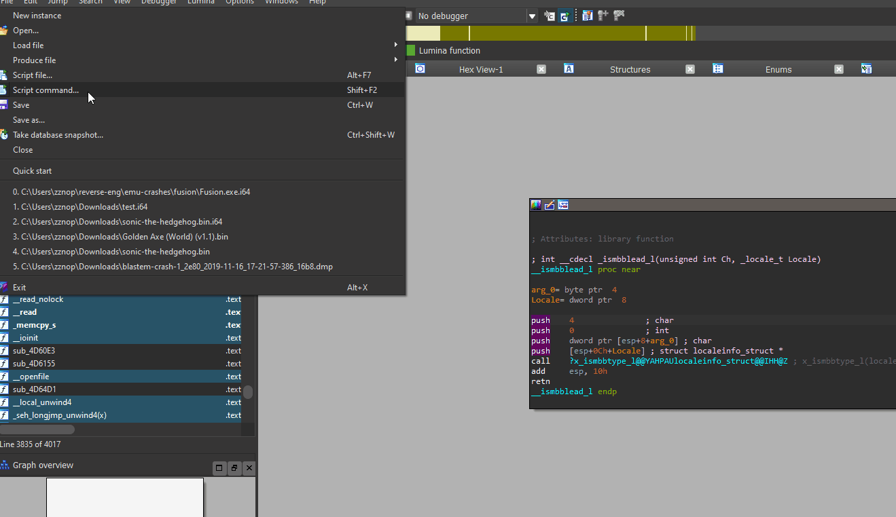

# bnida

## Description

bnida is a suite of plugins that provide the ability to transfer analysis data between Binary Ninja and IDA databases.
These plugins are designed to support a single, common JSON file format, that is used to perform one-shot transfers of
analysis data between Binja and IDA. A description of each plugin is provided below:

* `binja_export.py` - Exports analysis data from a Binja database to a bnida JSON file.
* `binja_import.py` - Imports analysis data from a bnida JSON file into a Binja database.
* `ida_export.py` - Exports analysis data from an IDA database to a bnida JSON file.
* `ida_import.py` - Imports analysis data from a bnida JSON file into an IDA database.

## Installation

1. Clone the [repository](https://github.com/zznop/bnida) to your Binary Ninja plugins folder

2. Copy the IDA scripts to your plugins folder (`C:\Program Files\IDA {version}\plugins` on Windows) and configure a hotkey.
   * These scripts can be run with `Alt + F7` from anywhere if you don't want to install them in the plugins folder.

## Usage

`binja_export.py` and `binja_import.py` are used to export/import analysis data into a Binary Ninja database to/from
a bnida JSON file. To export from a Binary Ninja database, click `Plugins->bnida->Export analysis data`. When prompted, enter the
file path for the bnida JSON file and click "OK". Likewise, to import data click `Plugins->bnida->Import analysis data` and
select the bnida JSON file.

`ida_export.py` and `ida_import.py` are used to export/import analysis data into/from an IDA database. These scripts
can be run with `Alt + F7` (same as any other IDA script). The process is similar to the Binary Ninja plugins. Enter
the path to bnida JSON file on export and select the file on import.

# Raw Binaries

While importing analysis data, bnida computes offsets for analysis objects relative to section start addresses. This
ensures imports are accurate even if the binary has been rebased. In the case of raw binaries that are loaded via
Binary Ninja's mapped view, sections must be applied manually. Any analysis object that does not reside in a section
will not be imported. Ensure that sections have been applied in both databases prior to transferring analysis data.

## License

This project is released under the MIT license.
