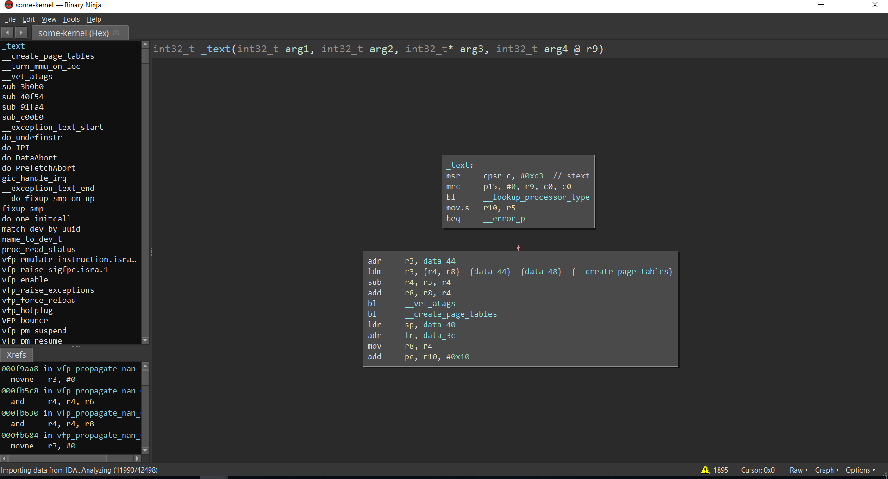
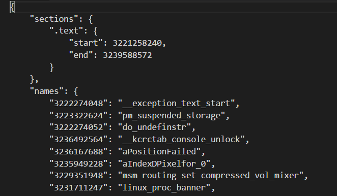
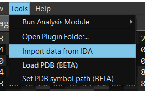
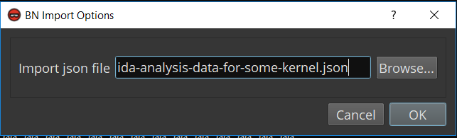
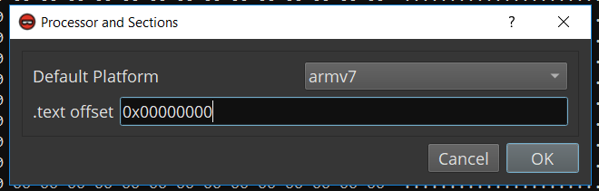
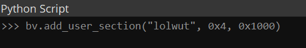
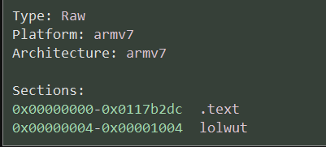

## bnida allows you to transfer analysis data between IDA Pro and Binary Ninja!

## How does it work?
bnida consists of IDA Pro and Binary Ninja plugins that export and import analysis data from a JSON file. This is done
by leveraging each platform's Python API. Plugin files
include:
* `binja_export.py` - BNDB to JSON file
* `binja_import.py` - JSON file to BNDB
* `ida_export.py` - IDB to JSON file
* `ida_import.py` - JSON file to IDB

### Before

### After

## Getting Started

### Setup and Configuration
To use bnida, clone the [repository](https://github.com/zznop/bnida). Then, move `binja_export.py` and `binja_import.py`
to your Binary Ninja plugins directory. On Linux, this directory is located at `~/.binaryninja/plugins/`. On Windows,
the BN plugin directory can be found in `%APPDATA%\Binary Ninja\plugins`.For the IDA plugins (`ida_export.py` and 
`ida_import.py`), I recommend moving them to `C:\Program Files\IDA 7.1\plugins` (Windows) and configuring a hotkey to
execute each IDAPython script. To do so, follow
[this](http://www.mopsled.com/2016/add-shortcut-for-idapython-script-ida-pro/) blog post. If you don't want to bother
with that, no problem. You can run `ida_export.py` or `ida_import.py` by simply typing `Alt+F7` to execute a script
file.

### IDA to Binary Ninja
1. Open your IDA database (or load a binary and allow analysis to complete)

2. Type `Alt+F7` and select the `ida_export.py`

    ##### Run IDA Export Script
    
    

3. Input the file path for the JSON file that will be created

4. Click Ok. Analysis data will be written to the JSON file

    ##### IDA Analysis Data JSON
    
    

5. Open your BN database for the same binary (or load a binary and allow analysis to complete)
6. Click `tools->Import data to BN`

    ##### Run Binja Import Plugin
    
    

7. Enter the file path to the JSON file

    ##### Supply File Path to IDA JSON
    
    

8. Click ok. Your database will then be updated with the analysis data from IDA.

### Binary Ninja to IDA

BN to IDA transfers require a similar process. The steps are as follows:

1. Open your Binary Ninja database (or load a binary and allow analysis to complete)
2. Click `tools->Export data from BN`
3. Input the file path for the JSON file that will be created
4. Click Ok. Analysis data will be written to the JSON file
5. Open your IDA database for the same binary (or load the binary and allow analysis to complete)
6. Type `Alt+F7` or click `File->Script File` and select the `ida_import.py`
7. Select the JSON file
8. Click ok. Your database will then be updated with the analysis data from BN.

## Additional Information

### Handling Flat Files
bnida calculates offsets between IDA and BN relative to the base address of the symbol's section. This is done to 
account for potential base address differences between the platforms. This design works excellent with PE and ELF 
executable file formats where the section names are defined in headers (which ensures section names are uniform).
However, with flat files (such as kernel images) where defining sections are left to the user, it is important to ensure
that section names are identical between the BNDB and IDB. Currently, `binja_import.py` contains a feature that allows
you to define the offsets for sections contained in the exported IDA JSON data. After selecting the JSON file, it checks
if the default processor has been set. If it has not been set, a input box will appear. The input box prompts the user
to define the default processor and set the base address for each section found in the JSON file.

##### Binja Import Prompt for Defining Sections

Sections can be defined manually using the Binary Ninja API and the script console, if needed. To create a section, use
`BinaryView.add_user_section(name, start, length)`. To validate that the section was created, navigate to linear view
and scroll to the top of the binary.

##### Add a Section Manually

##### BN Sections View

