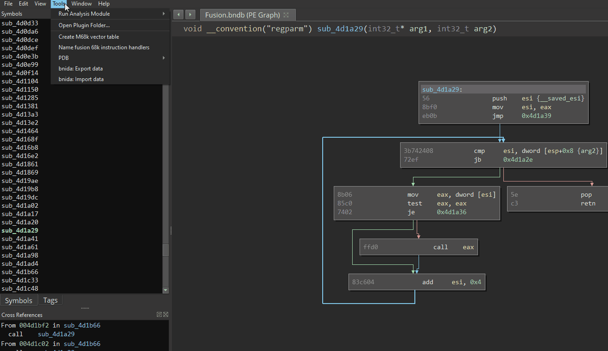

# Overview

bnida consists of (2) IDA Pro scripts and (2) Binary Ninja (BN) plugins that use IDAPython and BN Python API's to do
"one-shot" transfers of analysis data across IDA and BN databases. These scripts/plugins include:

* `binja_export.py` - Exports analysis data from a BN database to a bnida JSON file.
* `binja_import.py` - Imports analysis data from a bnida JSON file into a BN database.
* `ida_export.py` - Exports analysis data from an IDA database to a bnida JSON file.
* `ida_import.py` - Imports analysis data from a bnida JSON file into a IDA database.

All four scripts are designed to support a single, common JSON file format. This not only allows for transfers between
BN and IDA platorms, but also BN<->BN and IDA<->IDA too. This is especially useful if there is a desire to share
analysis data with someone using an older version of IDA who can't open your newer IDA database. The JSON file itself
is also easy to digest with custom tooling, since almost every programming language contains a JSON library. Currently,
bnida supports transferring the following analysis data:
* Functions
* Function comments
* Address comments
* Symbols
* Structures (beta)

Section information is also exported to the JSON file and used for adjusting offsets during imports.

# Installation

This section describes how to install bnida scripts on a Windows operating system. The process is similar on Linux.

1. Clone the [repository](https://github.com/zznop/bnida).

2. Copy the IDA scripts to `C:\Program Files\IDA {version}\plugins` and configure a hotkey. (or keep them where they are
if you prefer to run them as scripts with `Alt+F7`).

3. Copy the BN plugins to the Binary Ninja plugins folder at `%AppData%\Binary Ninja\plugins`

Optionally, you can keep the files where they are in the cloned repository and simply create symbolic links.

```
C:\Users\zznop\AppData\Roaming\Binary Ninja\plugins>mklink binja_export.py C:\Users\zznop\projects\bnida\binja\binja_export.py
symbolic link created for binja_export.py <<===>> C:\Users\zznop\projects\bnida\binja\binja_export.py
```

# Transferring Analysis Data

bnida can be used to transfer analysis data from BN to BN, IDA to IDA, BN to IDA, or IDA to BN. The following sections
describe how to use bnida plugins in IDA Pro and Binary Ninja.

## IDA Pro

`ida_export.py` and `ida_import.py` are used to export/import analysis data into/from IDA databases. To export from an
IDA database, press `ALT+F7` and open `ida_export.py`. When prompted, enter the file path for the bnida JSON file to be
generated and click "save". The script should create the file and populate it with data from your IDA database.
Similarly, to import data into an IDA database, run `ida_import.py`. When prompted, select the bnida JSON file and click
"save". Both IDA scripts print debug output to the output window.


## Binary Ninja

`binja_export.py` and `binja_import.py` are used to export/import analysis data into/from Binary Ninja databases. To
export from a BN database, click `Tools->bnida: Export data`. When prompted, enter the file path for the bnida JSON file
that will be generated and click "OK". The plugin should run in the background and create the bnida JSON file.
Likewise, to import data click `Tools->bnida: Import data`. When prompted, open the bnida JSON file. The plugin should
run in the background and apply the analysis data in the bnida JSON file to the open BN database.



# Raw Binaries

During imports, bnida adjusts offsets based on the symbol's/comment's/function's section base address. This is done to
allow data imports to succeed even if the binary has been rebased. This design works excellent with PE and ELF binaries
where section info is in headers and sections are applied by the loaders. In the case of raw binaries (i.e. flat
firmware images), sections must be applied manually. It is important to ensure that sections have been applied at the
same offsets across databases prior to attempting to transfer analysis data.

In addition to sections, ensure that the platform has been set in Binary Ninja before attempting to import analysis data
into a raw binary database. This can be done by loading the binary with options or using the Python API to set
`bv.platform`. This is required so that the importer plugin can create functions. Likewise, ensure the correct processor
is set in IDA before import.
